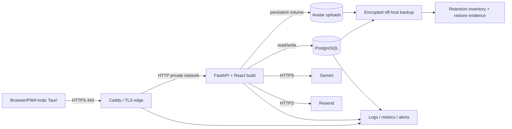

# Đề xuất deployment và vận hành

> Trạng thái: **PROPOSED – chờ Release/Operations Gate**. Tài liệu này mô tả deployment mục tiêu cho hệ thống nhỏ, online-only; không phải bằng chứng hệ thống đã được triển khai, đo tải, kiểm thử khôi phục hay đạt SLA/compliance. Cấu hình hiện có được ghi rõ là **hiện trạng**; các kiểm soát chưa có bằng chứng được ghi là **cần triển khai/kiểm chứng**.

## 1. Mục tiêu, phạm vi và quyết định còn mở

Phạm vi gồm build/release, HTTPS, PostgreSQL, migration, avatar bền vững, secrets, health/readiness, log, metric, backup/restore/retention và incident runbook. Deployment tham chiếu `Dockerfile`, `compose.yaml`, `compose.azure.yaml`, `deploy/Caddyfile` và [hướng dẫn Azure](azure-deploy.md); tài liệu này không thay đổi source code hay hạ tầng.

Các mục tiêu baseline đã duyệt:

- NFR-REL-002: hướng tới gần 24/7 và xử lý sự cố trong vòng 24 giờ.
- NFR-PERF-001: thao tác thông thường dưới 10 giây ở tải bình thường.
- BR-004/NFR-PRIV-003: dữ liệu account đã xóa không còn trong backup sau tối đa 30 ngày.
- Production dùng PostgreSQL và Alembic; migration gặp collision/duplicate/conflict phải dừng, không tự sửa hoặc xóa dữ liệu.

Các giá trị sau **chưa được quyết định** và không được suy diễn từ mục tiêu trên: availability SLO/SLI window, định nghĩa “xử lý” là acknowledge/mitigate/resolve, severity/on-call coverage, RPO, RTO, workload “bình thường” (concurrency, dataset, request mix), latency percentile và capacity tối đa. Lịch backup hằng ngày bên dưới là đề xuất kiểm soát dữ liệu, **không phải RPO đã duyệt**.

## 2. Kiến trúc deployment mục tiêu

Một VM là phù hợp cho quy mô nhỏ và hiện trạng Compose, nhưng là single point of failure; `restart: unless-stopped` không chứng minh high availability. Caddy tự cấp/gia hạn certificate khi DNS và cổng 80/443 hợp lệ. PostgreSQL không được public port; app port chỉ bind loopback trong cấu hình Azure. `postgres_data`, `uploads_data` và `caddy_data` là persistent volume nhưng **không phải backup**.

Hiện trạng có bằng chứng trong repo:

- Image chạy non-root, frontend được build trong multi-stage image, API dùng `AUTO_CREATE_SCHEMA=false` ở production.
- Entrypoint chạy `alembic upgrade head` rồi mới `uvicorn`; Docker healthcheck gọi `/api/health`; `/api/ready` thực hiện query database.
- Compose giữ PostgreSQL và `/app/uploads` trong named volume; Caddy mở 80/443; Docker JSON logs được rotate 10 MiB × 3 file/container trong override Azure.
- Chưa thấy metrics exporter/dashboard/alert rule, structured access log với correlation ID, backup scheduler/encryption/expiry automation hoặc restore evidence trong các đầu vào. Vì vậy các mục này là proposal, chưa được tuyên bố đã vận hành.

## 3. Build và release flow

Mỗi release phải là artifact bất biến, truy vết được bằng Git commit và image digest; không build tùy ý từ working tree trên production. Pipeline mục tiêu:

1. Checkout commit/tag đã chọn; ghi commit, dependency lockfile và image digest vào release record.
2. Chạy backend tests, frontend tests và production frontend build. Failure ở bất kỳ bước nào chặn release.
3. Build image một lần; scan dependency/image là kiểm soát đề xuất, chỉ ghi “pass” khi có report lưu cùng release.
4. Trên bản sao PostgreSQL đại diện đã khử nhạy cảm: chạy migration preflight, `alembic upgrade head`, smoke test và, nếu tuyên bố hỗ trợ downgrade, round-trip upgrade → downgrade → upgrade.
5. Tạo backup DB + avatar hợp lệ trước maintenance window; xác minh checksum, encryption và bản sao off-host. Backup lỗi chặn deploy.
6. Chặn traffic mới hoặc giữ instance hiện tại phục vụ; chạy một **migration job duy nhất** với cùng image/revision. Chỉ mở traffic cho image mới sau khi migration exit 0 và `alembic current` đúng revision kỳ vọng.
7. Khởi động app mới, kiểm tra health/readiness và smoke test; sau đó mới chuyển traffic. Lưu deployment record và theo dõi tăng cường.

Entrypoint hiện tại chạy migration ở mỗi lần web container khởi động. Cách này bảo đảm API trong chính container đó chưa start trước migration, nhưng không đủ an toàn khi scale nhiều replica hoặc rolling update. Trước khi có migration job riêng, chỉ cho phép một web replica, giữ proxy khỏi instance đang khởi động và không mở traffic nếu migration lỗi. Không dùng `Base.metadata.create_all`/runtime schema helper ở production.

### Migration conflict gate

Preflight phải chạy trước maintenance window và lặp lại trong migration theo [database design](../design/database-design.md): identity collision, category blank/duplicate, budget duplicate, orphan/cross-owner FK, invalid domain/precision và backfill invalid. Báo cáo chỉ chứa loại lỗi, count và sample ID cần xử lý; không chứa password, token, note hoặc payload cá nhân.

Nếu có conflict: migration exit khác 0, transaction rollback, app version mới không nhận traffic, release đánh dấu failed và incident/change record nhận report. Không tự trim/rename/chọn winner/xóa row. Việc xử lý dữ liệu cần quyết định con người và một release mới hoặc retry có phê duyệt.

## 4. Secrets, HTTPS và dữ liệu bền vững

- Secret chỉ được inject ở runtime qua secret store hoặc environment được bảo vệ; `.env` production có quyền đọc tối thiểu và không nằm trong Git, image, log, ticket hay backup manifest. Tài liệu chỉ ghi **tên biến**, không ghi giá trị.
- Biến bắt buộc/điều kiện gồm `POSTGRES_PASSWORD`, `SECRET_KEY`, `FRONTEND_URL`, `TRUSTED_HOSTS`, `CORS_ORIGINS`; `AI_API_KEY`, `RESEND_API_KEY`, `RESEND_FROM_EMAIL` chỉ khi bật integration. Rotation phải có owner, ngày thực hiện và validation; cadence chưa quyết định.
- Public traffic chỉ qua HTTPS; cổng 5432/8000 không public. Theo dõi expiry certificate và thử HTTPS từ ngoài mạng. Không tuyên bố encryption at rest cho volume hiện tại nếu chưa có bằng chứng disk/storage encryption.
- Avatar nằm tại `/app/uploads` trên `uploads_data`. Sau restart/recreate phải kiểm tra file vẫn đọc được. Backup/restore DB và avatar phải cùng restore point hoặc app phải chịu được reference thiếu; hiện chưa có snapshot atomic nên phương án an toàn là maintenance window dừng web trong lúc thu backup cặp.

## 5. Health, readiness, logs và metrics

`GET /api/health` chỉ chứng minh process trả response; không dùng để khẳng định dependency khỏe. `GET /api/ready` query PostgreSQL và phải trả non-2xx khi DB lỗi; proxy/orchestrator chỉ đưa instance vào traffic khi readiness pass. Gemini/Resend không nên làm readiness fail vì là dependency theo tính năng; theo dõi riêng bằng metric/synthetic check.

Telemetry mục tiêu không được chứa authorization header, cookie/token, password/reset artifact, API key, DB URL, raw transaction/note, AI prompt/response hoặc nội dung avatar. Correlation ID phải được sinh/propagate qua proxy và app; log dùng UTC timestamp, severity, service/version, route template, status, latency, correlation ID và error class đã chuẩn hóa.

| Tín hiệu | Metric/evidence cần lưu | Trigger ban đầu (PROPOSED) |
|---|---|---|
| Availability | synthetic HTTPS success và readiness, chu kỳ 1 phút; monthly probe report | 2 lần liên tiếp fail → cảnh báo |
| Latency NFR-PERF-001 | end-to-end duration theo route, p50/p95/p99; load-test report có environment, dataset, concurrency, request mix | bất kỳ thao tác chuẩn ≥10 giây hoặc p95 vượt ngưỡng sau khi workload được duyệt → chặn/rollback |
| HTTP errors | request count và 5xx ratio theo route/version | 5xx tăng rõ so với baseline hoặc smoke test có 5xx → điều tra/rollback |
| PostgreSQL | readiness, connection usage/pool wait, query latency, disk free, backup age | readiness fail hoặc disk tiến gần ngưỡng vận hành đã cấu hình |
| Integrations | Gemini/Resend request, timeout, error và latency không chứa payload | error/timeout liên tiếp → degrade tính năng và incident |
| Host/container | CPU, RAM, disk/inode, restart count | saturation/restart bất thường → incident; threshold capacity chưa quyết định |
| Backup | job result, UTC timestamp, object inventory, size, checksum, encryption/key ID, expiry date, off-host copy | job/checksum/copy/expiry fail hoặc backup quá 26 giờ → incident |
| Retention | daily inventory of oldest object và deletion log | object quá 30 ngày → privacy incident |
| Restore | quarterly drill record: backup IDs, isolated target, start/end, checks, cleanup | drill fail → release/operations risk; RTO chưa được suy ra |

Threshold capacity cụ thể phải được baselined sau đo tải. Trigger ban đầu là guardrail vận hành, không phải SLA/SLO đã duyệt.

## 6. Backup, restore và retention

### Lịch và bảo vệ

- **Hằng ngày, giờ thấp tải (PROPOSED 02:00 `Asia/Ho_Chi_Minh`)**: dừng web hoặc vào maintenance mode; tạo PostgreSQL custom-format dump và archive avatar; ghi chung restore-point ID/UTC timestamp; khởi động lại sau khi cả hai thành công.
- **Trước mọi migration/release có thay đổi dữ liệu**: tạo một backup cặp riêng và xác minh như trên.
- Mỗi artifact được mã hóa trước hoặc bằng storage-managed encryption với key tách khỏi backup location; truyền ra off-host bằng TLS. Chỉ backup operator/restore role có quyền đọc. Không ghi key/passphrase trong repo hoặc manifest.
- Sinh SHA-256 checksum, kiểm tra có thể đọc/decrypt/list, sao chép ít nhất một bản ra ngoài VM và ghi immutable/tamper-evident job record theo khả năng nền tảng. Cảnh báo nếu job/copy/checksum thất bại.
- Retention **30 ngày tối đa** cho mọi backup chứa dữ liệu cá nhân, kể cả pre-release backup. Expiry theo thời điểm tạo, chạy deletion job hằng ngày; không có nhánh “monthly/yearly” vượt 30 ngày. Log inventory trước/sau xóa và cảnh báo artifact quá hạn.

Lịch hằng ngày tạo khoảng mất dữ liệu tiềm năng gần 24 giờ trong trường hợp chỉ có full dump, nhưng đây chỉ là đặc tính kỹ thuật dự kiến; **RPO chưa được duyệt**. Thời gian restore phụ thuộc kích thước và hạ tầng; **RTO chưa được duyệt**.

### Restore drill và evidence

Thực hiện ít nhất mỗi quý và sau thay đổi lớn của PostgreSQL/backup tooling:

1. Chọn restore-point còn hạn; xác minh manifest, checksum, encryption/key access và cặp DB/avatar.
2. Tạo môi trường cô lập, không public, database trống và volume avatar trống; không restore đè production để thử nghiệm.
3. Decrypt trong vùng tạm được bảo vệ, `pg_restore` vào PostgreSQL version tương thích và giải nén avatar với path/ownership an toàn.
4. Chạy `alembic current`, integrity/FK checks, row-count reconciliation; kiểm tra đăng nhập bằng test fixture, owner isolation, dữ liệu tài chính mẫu và avatar sample. Không gửi email/Gemini thật.
5. Ghi start/end/duration, backup ID, image/revision, PostgreSQL version, checks pass/fail, dữ liệu thiếu và người duyệt. Xóa an toàn môi trường/dữ liệu drill theo policy.

Evidence tối thiểu mỗi ngày: job ID, restore-point ID, DB/avatar object IDs, created/expiry UTC, checksum, encryption/key ID (không phải key), off-host location class và result. Evidence retention: inventory hằng ngày chứng minh object cũ nhất ≤30 ngày, deletion log và alert history. Account hard delete không xóa chọn lọc khỏi immutable backup; tuân thủ bằng việc mọi restore point chứa account tự hết hạn trong 30 ngày. Nếu legal hold được đề xuất, phải qua Privacy Gate vì hiện xung đột baseline.

## 7. Checklist deploy

### Pre-deploy

- [ ] Release record có commit/tag, image digest, Alembic revision, owner và change window.
- [ ] Backend/frontend/build evidence pass; không suy diễn từ lần chạy cũ.
- [ ] Image/dependency scan report được lưu nếu kiểm soát scan đã được bật.
- [ ] Cấu hình production render thành công; không có secret trong Git/image/log/output.
- [ ] DNS/HTTPS hợp lệ; 5432/8000 không public; disk/CPU/RAM có headroom đã kiểm tra.
- [ ] Backup DB + avatar trước release đã mã hóa, checksum pass, off-host copy pass và có expiry ≤30 ngày.
- [ ] Preflight trên bản sao đại diện sạch; migration rehearsal pass; conflict fixture chứng minh migration dừng và dữ liệu không đổi.
- [ ] Rollback path phù hợp revision đã diễn tập; nếu migration không backward-compatible, có restore plan và maintenance window được chấp thuận.
- [ ] Traffic gate bảo đảm migration job duy nhất hoàn tất trước khi image mới nhận request.
- [ ] Dashboard/alerts và incident contact hoạt động; chưa có on-call 24/7 thì ghi rõ coverage gap.

### Post-deploy trước mở traffic/hoàn tất change

- [ ] Migration exit 0; `alembic current` đúng revision; không có conflict report chưa xử lý.
- [ ] `/api/health` và `/api/ready` pass từ nội bộ; HTTPS synthetic pass từ bên ngoài.
- [ ] SPA deep link, auth, hai-user owner isolation và CRUD critical path pass.
- [ ] Upload/read avatar pass và vẫn tồn tại sau container restart/recreate có kiểm soát.
- [ ] Gemini/Resend success/error path pass nếu được cấu hình; không lộ stack trace/secret.
- [ ] Latency thao tác chuẩn dưới 10 giây trong workload đã ghi; nếu workload chưa duyệt, ghi `UNDECIDED`, không tuyên bố đạt NFR.
- [ ] Error rate, DB connections/query latency, CPU/RAM/disk và restart count không regress so với baseline.
- [ ] Log có version/correlation ID và không chứa dữ liệu cấm; alert test tới đúng người nhận.
- [ ] Deployment record có kết quả, timestamp, evidence links và quyết định continue/rollback; theo dõi tăng cường tối thiểu 30 phút (PROPOSED).

## 8. Rollback conditions và procedure

Rollback/stop traffic ngay khi: migration lỗi/conflict; readiness không ổn định; data corruption/cross-user exposure; secret exposure; auth critical path lỗi; 5xx hoặc latency vượt guardrail sau release; avatar mất/không đọc được; hoặc telemetry cần thiết không đủ để đánh giá an toàn.

1. Dừng chuyển traffic và giữ evidence/log; không retry migration mù quáng.
2. Nếu schema backward-compatible và đã rehearsal, route về image digest cũ rồi smoke test.
3. Nếu schema không backward-compatible hoặc dữ liệu đã bị biến đổi, vào maintenance mode và thực hiện restore đã duyệt từ backup pre-release. Không chạy downgrade chưa có round-trip evidence.
4. Xác minh Alembic revision, integrity, owner isolation, avatar và critical flows; chỉ mở traffic sau readiness/smoke pass.
5. Ghi timeline, impact, quyết định, backup/release IDs và follow-up. Rollback application không hoàn tác account hard delete và không thay đổi retention backup.

## 9. Incident checklist

Mục tiêu 24 giờ hiện được vận hành thận trọng như: phát hiện/triage, giới hạn ảnh hưởng hoặc có kế hoạch khôi phục được phê duyệt trong 24 giờ; đây là **diễn giải PROPOSED**, không phải cam kết resolution/SLA cho đến khi Human Gate chốt severity và coverage.

- [ ] Acknowledge, mở incident record, ghi UTC start/detection, reporter, affected capability và correlation/release IDs.
- [ ] Phân loại: security/privacy hoặc cross-user/data loss = critical; outage/DB/disk/certificate = high; integration đơn lẻ có graceful error = medium (severity matrix vẫn cần duyệt).
- [ ] Bảo toàn log/evidence nhưng không sao chép secret/PII vào ticket; revoke/rotate credential nếu nghi lộ.
- [ ] Kiểm tra synthetic/readiness, recent deploy/migration, container restart, DB/disk, certificate, backup age và integration status.
- [ ] Chọn mitigate: rollback, maintenance mode, disable/degrade integration, tăng dung lượng theo quyền được phê duyệt hoặc restore. Không tự sửa dữ liệu conflict.
- [ ] Với privacy/retention: cô lập access, giữ inventory/deletion evidence, xác định restore points liên quan; không gia hạn backup quá 30 ngày nếu chưa có Privacy Gate.
- [ ] Cập nhật stakeholder theo cadence được duyệt; nếu chưa có, mỗi 4 giờ cho incident đang ảnh hưởng người dùng là proposal ban đầu.
- [ ] Chỉ resolve khi probes/critical flow/metrics ổn định và data integrity được xác nhận; ghi thời gian acknowledge/mitigate/resolve riêng.
- [ ] Post-incident review trong 5 ngày làm việc (PROPOSED): root cause, timeline, impact, detection gap, action owner/due date và test ngăn tái diễn.

## 10. Traceability NFR và evidence gate

| Requirement/mục tiêu | Metric/evidence chấp nhận | Trạng thái từ đầu vào |
|---|---|---|
| NFR-REL-002 gần 24/7 | synthetic success/total theo window đã duyệt; incident acknowledge/mitigate/resolve timestamps | Mục tiêu đã duyệt; SLI/SLO window, severity, coverage và nghĩa “xử lý” **chưa quyết định**; chưa có report |
| NFR-PERF-001 <10 giây | load/synthetic report theo thao tác với percentile, concurrency, dataset, environment và version | Mục tiêu đã duyệt; workload/percentile/capacity **chưa quyết định**; chưa có report |
| NFR-PRIV-003/BR-004 ≤30 ngày | backup inventory, created/expiry, deletion job log, oldest-object alert và account-deletion retention audit | Giới hạn đã duyệt; automation/evidence chưa có trong đầu vào |
| NFR-DATA-001 PostgreSQL/migration | image/revision, preflight report, `alembic current`, PostgreSQL migration/rehearsal evidence | Cấu hình PostgreSQL/Alembic hiện có; migration đích và evidence production còn pending |
| NFR-PRIV-002 encryption in transit | external TLS probe/certificate evidence; vendor HTTPS evidence | Caddy target có HTTPS; chưa có evidence runtime, không tuyên bố compliance |
| NFR-SEC-002 secrets | secret scan/config review, runtime injection record và redaction test | Environment names có; secret store/rotation/redaction evidence chưa có |
| FR-REL-001 health/readiness | probe results và DB-failure readiness test | Endpoint/code có; chưa có monitor history |
| Persistent avatar | restart/recreate và paired restore drill evidence | Named volume có; restore evidence chưa có |
| Backup/restore | daily job evidence, encrypted off-host object, quarterly drill | Lịch/controls là proposal; RPO/RTO **chưa quyết định** |
| Logs/metrics | dashboard snapshot/query, alert delivery test, redaction/correlation test | Chỉ có Docker log rotation; metrics/correlation/alerts chưa có bằng chứng |

Không được đóng Release Gate chỉ vì checklist tồn tại. Mỗi ô cần link tới artifact có timestamp/version hoặc ghi rõ `UNDECIDED`/`NOT VERIFIED`.

## 11. Các quyết định cần Human Gate

1. Availability SLI/SLO/window và coverage/on-call phù hợp “gần 24/7”.
2. Incident severity, thời hạn acknowledge/mitigate/resolve và nghĩa chính xác của “xử lý trong 24 giờ”.
3. Workload bình thường, latency percentile, dataset/request mix và capacity target.
4. RPO/RTO, backup full/incremental/PITR và ngân sách off-host storage.
5. Nền tảng metrics/log/alert, retention telemetry và người nhận cảnh báo.
6. Secret store, rotation cadence, backup key ownership và break-glass procedure.
7. Maintenance window/downtime chấp nhận được và chiến lược migration job tách khỏi web entrypoint.

Hướng dẫn thao tác VM hiện có ở [azure-deploy.md](azure-deploy.md). Khi proposal này được duyệt và automation thực sự tồn tại, hướng dẫn đó cần được đồng bộ để không còn mô tả backup thủ công như kiểm soát production đầy đủ.
