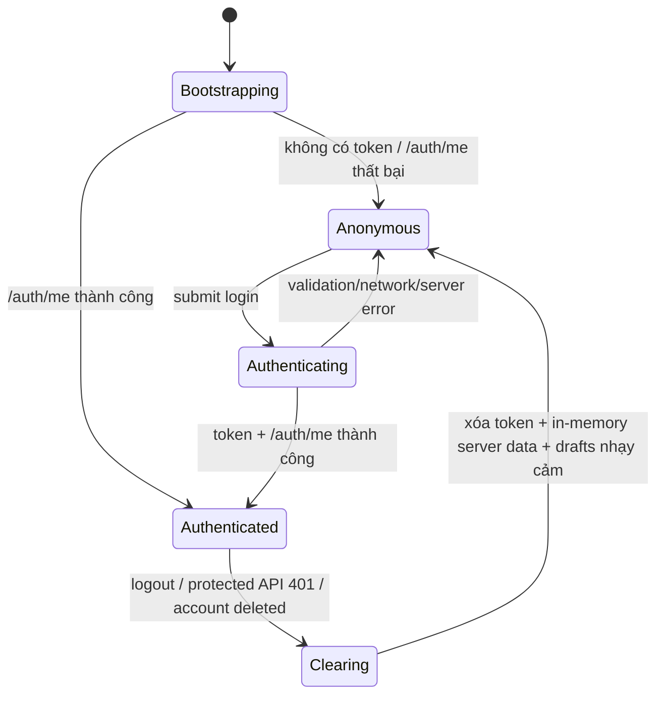
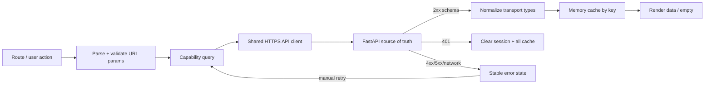

# Thiết kế frontend Sổ Chi Tiêu

> Baseline thiết kế cho React + TypeScript dùng chung trên web, PWA và Tauri (online-only). Tài liệu dựa trên Requirements Gate và Architecture Gate đã `APPROVED` ngày 06/09/2026, `DESIGN.md` và việc đọc hiện trạng `frontend/src`. Đây là thiết kế mục tiêu, không phải xác nhận implementation hiện tại đã đáp ứng. Tài liệu không thay đổi API contract.

## 1. Mục tiêu, nguyên tắc và ranh giới

Frontend là một “phòng điều khiển tài chính yên tĩnh”: giúp cá nhân nhìn thấy vị thế hiện tại, ngoại lệ cần chú ý và hành động tiếp theo trên cùng dữ liệu máy chủ ở web/PWA/Tauri. Chế độ UX là **Operate**; tính rõ ràng, khả năng kiểm chứng và tính liên tục của tác vụ quan trọng hơn trang trí.

Các nguyên tắc bắt buộc:

- FastAPI là nguồn sự thật duy nhất. Client không có business database, outbox, sync/conflict engine và không cache `/api/*`, `/uploads/*` hoặc response nghiệp vụ để dùng offline.
- Mọi mutation chỉ chuyển sang success sau response thành công của server. Không optimistic success; timeout/mất mạng là kết quả chưa biết và không được tự retry mutation không idempotent.
- Access token được gắn qua shared API client; response `401` ở endpoint bảo vệ làm sạch phiên và cache trong bộ nhớ rồi điều hướng về đăng nhập.
- Gemini, Resend, storage credential và mọi secret chỉ ở backend. Assistant chỉ render response/evidence đã được backend kiểm chứng, không gọi Gemini trực tiếp và không có công cụ mutation.
- Tiền hiển thị VND, một chữ số thập phân, tabular numerals; kỳ theo `Asia/Ho_Chi_Minh`. Client không tự tính lại giá trị authoritative từ dữ liệu rời.
- Giữ nguyên palette, typography, spacing, radius, elevation, breakpoints, semantic-color rules và component rules trong `DESIGN.md`.
- UI tiếng Việt, responsive, keyboard-first, focus-visible, screen-reader có nghĩa, reduced-motion và light/dark theme.

Ngoài phạm vi: offline nghiệp vụ, background sync, kết nối ngân hàng, thanh toán, đầu tư tự động, AI sửa dữ liệu, admin và thay đổi API chưa qua review.

## 2. Kiến trúc module frontend

```text
src/
├─ app/
│  ├─ AppProviders             # auth, theme, router, query/data boundary
│  ├─ AppRouter                # route tree, guards, not-found
│  └─ AppShell                 # desktop rail / mobile top+bottom navigation
├─ auth/
│  ├─ AuthSession              # bootstrap /auth/me, login, logout, clearSession
│  ├─ ProtectedRoute
│  └─ PublicOnlyRoute
├─ api/
│  ├─ httpClient               # base URL, bearer, AbortSignal, error normalization
│  ├─ queryKeys                # canonical keys by user scope + period/filter
│  └─ capability clients       # auth, categories, transactions, budgets, goals,
│                               # analytics, assistant
├─ features/
│  ├─ auth/                    # login/register/forgot/reset
│  ├─ profile/                 # profile/avatar/delete-account flows
│  ├─ dashboard/
│  ├─ categories/
│  ├─ transactions/
│  ├─ budgets/
│  ├─ goals/
│  ├─ reports/
│  └─ assistant/
├─ components/
│  ├─ primitives/              # Button, Field, Alert, Skeleton, EmptyState
│  ├─ overlays/                # SidePanel, Dialog, ConfirmDialog, Drawer
│  ├─ finance/                 # Money, PeriodPicker, CategoryAvatar, Progress
│  └─ feedback/                # ConnectionBanner, PageError, InlineError, Toast
├─ state/
│  ├─ server-state policy      # query lifecycle/invalidation; no persisted business data
│  └─ ui-state                # theme, open overlay, draft/filter state
├─ lib/                        # VND/date formatting, validation helpers, icon taxonomy
└─ types/                      # generated/hand-kept API view types; no secret types
```

Đây là phân ranh trách nhiệm, không yêu cầu đổi tên file ngay. Feature page chỉ phối hợp view state và capability client; shared client xử lý transport/session; invariant nghiệp vụ vẫn ở server. Không tạo một global store chứa bản sao toàn bộ dữ liệu tài chính.

### 2.1 Component/page hierarchy

```text
AppProviders
├─ ConnectionBanner (global, non-modal)
└─ AppRouter
   ├─ AuthLayout
   │  ├─ LoginPage → AuthForm
   │  ├─ RegisterPage → AuthForm
   │  ├─ ForgotPasswordPage → RecoveryRequestForm
   │  └─ ResetPasswordPage → ResetPasswordForm / invalid-link state
   ├─ ProtectedRoute
   │  └─ AppShell
   │     ├─ PrimaryNavigation
   │     ├─ AccountEntry → ProfilePanel
   │     │                  └─ DeleteAccountDialog
   │     └─ MainContent
   │        ├─ DashboardPage
   │        │  ├─ PositionSummary
   │        │  ├─ ExceptionRail
   │        │  ├─ SpendingComposition / Trend
   │        │  └─ RecentTransactions / GoalProgress
   │        ├─ CategoriesPage
   │        │  ├─ CategorySummary
   │        │  ├─ CategoryList
   │        │  └─ CategoryPanel(create/edit) / DeleteConfirm
   │        ├─ TransactionsPage
   │        │  ├─ TransactionSummary
   │        │  ├─ FilterBar / mobile FilterDrawer
   │        │  ├─ TransactionList + Pagination
   │        │  └─ TransactionComposer / mobile SidePanel / DeleteConfirm
   │        ├─ BudgetsPage
   │        │  ├─ BudgetPosition + AttentionRail
   │        │  ├─ BudgetList
   │        │  └─ BudgetPanel(create/edit) / DeleteConfirm
   │        ├─ GoalsPage
   │        │  ├─ GoalSummary + GoalList
   │        │  ├─ GoalDetailPanel
   │        │  │  ├─ ItemPlan + History
   │        │  │  └─ Deposit / Withdraw / Complete dialogs
   │        │  └─ GoalPanel(create/edit) / DeleteConfirm
   │        ├─ ReportsPage
   │        │  ├─ PeriodComparisonSummary
   │        │  ├─ GroupedCategoryChart
   │        │  ├─ Composition / Movers
   │        │  └─ AuthoritativeDetailTable
   │        └─ AssistantPage
   │           ├─ HistoryRail / HistoryDrawer
   │           ├─ ConversationCanvas
   │           │  ├─ GuidedStarters
   │           │  ├─ MessageList + EvidenceDisclosure
   │           │  └─ Composer
   │           └─ PrivacyRail / PrivacyDrawer
   └─ NotFoundPage
```

## 3. Route map và navigation

| Route | Guard | Screen | URL state/canonical behavior | Entry/exit focus |
|---|---|---|---|---|
| `/login` | public-only | Đăng nhập | `state.from` chỉ nhận internal path an toàn; thành công quay lại path hợp lệ hoặc `/dashboard` | focus identifier; lỗi vào alert rồi giữ field sửa được |
| `/register` | public-only | Đăng ký | không chứa credential trong URL | focus field đầu; success chỉ sau server, chuyển đăng nhập |
| `/forgot-password` | public-only | Yêu cầu reset | response luôn trung tính, chống enumeration | focus email; status được announce |
| `/reset-password?token=…` | public | Đặt mật khẩu mới | token chỉ đọc để gửi server; không log/persist; thiếu/invalid/expired có state riêng | focus mật khẩu hoặc heading lỗi |
| `/` | protected | Redirect | replace → `/dashboard` | — |
| `/dashboard?period=YYYY-MM` | protected | Tổng quan | period hợp lệ; thiếu dùng tháng hiện tại Hà Nội | focus `h1` sau navigation |
| `/transactions?period=YYYY-MM&type=&category=&from=&to=&q=&page=` | protected | Giao dịch | filter chia sẻ/deep-link; normalize invalid values; back/forward phục hồi | panel trả focus về CTA/row opener |
| `/categories?type=income|expense` | protected | Danh mục | type là filter UI, không authorization | như trên |
| `/budgets?period=YYYY-MM` | protected | Ngân sách | năm client prevalidate 2000–2100; server authoritative | như trên |
| `/goals?status=&goal=` | protected | Mục tiêu | `goal` mở detail nếu thuộc user; 404 không tiết lộ ownership | detail panel trả focus đúng card |
| `/reports?period=YYYY-MM` | protected | Báo cáo | link category → transactions với filter tương ứng | focus vùng báo cáo; vùng scroll có tên |
| `/assistant?period=YYYY-MM&conversation=` | protected | Trợ lý | conversation server-owned; starter chỉ điền composer, chưa gửi | drawers trả focus opener; composer sau chọn starter |
| `*` | theo session | Không tìm thấy | public session → login; authenticated → NotFound có link dashboard, không silent redirect | focus heading |

Desktop dùng sidebar 248px, thu thành icon rail ở 980px. Dưới 760px dùng top brand bar và bottom navigation cố định gồm Tổng quan, Giao dịch, Báo cáo, Trợ lý, Thêm. “Thêm” mở danh sách Categories, Budgets, Goals và Profile; trạng thái destination vẫn được công bố bằng `aria-current="page"`. Tauri dùng cùng route tree và API HTTPS; deep-link/reset link chỉ được bật khi shell protocol đã được duyệt, nếu chưa thì mở web.

## 4. Authentication, session và route guards

### 4.1 Session state machine



- Trong `Bootstrapping`, guard hiển thị session skeleton với `aria-busy`; không flash protected content hoặc login form.
- `ProtectedRoute` giữ full intended location. Sau login chỉ điều hướng tới same-origin internal route; loại bỏ absolute/protocol URL.
- `PublicOnlyRoute` chuyển authenticated user về intended protected route hoặc dashboard.
- `401` từ request bảo vệ phát một sự kiện/session action duy nhất: abort request còn chạy nếu có thể, clear token, user, query cache và draft nhạy cảm; replace tới `/login` với thông báo “Phiên đã hết hạn. Vui lòng đăng nhập lại.”
- Không coi `403`, `404`, `422`, `429` là session expiry. `401` từ login chỉ là lỗi credential, không tạo vòng redirect.
- Logout là local session termination theo contract hiện tại; không tuyên bố revoke token server-side.
- Token storage policy/revoke sớm còn mở ở `ARCH-HG-007`; thiết kế không tự thêm refresh token/cookie contract.

### 4.2 Recovery và identity

- Login nhận email hoặc username và copy không ám chỉ phân biệt hoa/thường (`US-008`).
- Forgot-password luôn hiển thị cùng thông báo sau server success để không tiết lộ account existence.
- Reset form kiểm token tồn tại, password/confirmation và chỉ success sau server. Expired/used token cung cấp CTA yêu cầu link mới.
- Password không được giữ sau navigation, error telemetry, URL hoặc persisted draft.

## 5. State và data flow

### 5.1 Phân loại state

| Loại | Ví dụ | Nơi giữ | Persistence |
|---|---|---|---|
| Session | user, bootstrap status | AuthSession | token theo policy hiện có; user chỉ memory |
| Server state | lists, dashboard, report, conversation | query cache theo capability/user/params | memory only; clear khi logout/401/delete |
| URL state | period, filter, page, selected goal/conversation | router search params | URL, không chứa secret/note/raw draft |
| Draft form | amount, note, name, uploaded File | local component/form state | memory trong phiên màn hình; giữ qua network error khi an toàn |
| UI state | overlay open, selected tab, disclosure | component/context hẹp | memory; theme là ngoại lệ có thể lưu preference |
| Theme | light/dark/system | ThemeProvider | local preference, không phải business data |
| Connectivity | browser online signal + request evidence | ConnectionStatus | không persist |

Query key tối thiểu có capability và normalized params, ví dụ `['transactions', period, filters]`. Dữ liệu giữa user không được dùng chung; logout/401/delete clear toàn bộ. Period và filter được normalize một lần. Derived presentation values có thể memoize, nhưng `spent`, `is_over`, available balance, report totals và goal invariants luôn lấy từ response server.

### 5.2 Read flow



Route/period thay đổi abort read cũ. Read có thể retry thủ công; retry tự động chỉ cho lỗi transient nếu không gây spam và luôn hữu hạn. Khi đang refetch, dữ liệu cũ có thể tiếp tục hiển thị với “Đang cập nhật…” nếu đúng cùng query key; không trộn kỳ/filter khác.

### 5.3 Mutation flow

```mermaid
sequenceDiagram
    actor U as Người dùng
    participant F as Form/Dialog
    participant A as API client
    participant S as FastAPI
    participant C as Memory cache
    U->>F: nhập + submit
    F->>F: client validation, set submitting
    F->>A: một command HTTPS
    A->>S: authenticated request
    alt server xác nhận 2xx
        S-->>A: committed response
        A-->>F: success
        F->>C: replace/invalidate affected keys
        F-->>U: status/toast + close/continue
    else validation/business error
        S-->>A: 4xx stable error
        A-->>F: field/form error; giữ draft
    else network/timeout/5xx
        A-->>F: outcome không xác định/thất bại
        F-->>U: giữ draft; không success; manual recovery
    end
```

Submit khóa nút chính và ngăn double-submit; các field cần giữ để người dùng hiểu command đang gửi. Cancel bị vô hiệu hoặc yêu cầu xác nhận khi abort không đảm bảo hủy server commit. Sau 2xx, dùng response làm dữ liệu mới rồi invalidate các aggregate liên quan. Không tự cộng/trừ tiền trước server.

Nếu timeout sau khi gửi mutation, copy phải nói “Chưa thể xác nhận thao tác đã hoàn tất”; reload dữ liệu nguồn trước khi cho retry. Cho tới khi durable idempotency contract ở `docs/software/design/backend-design.md` được duyệt/triển khai, không tự retry `POST/PATCH/DELETE` có thể gây lặp.

### 5.4 Invalidation matrix

| Mutation | Cập nhật/invalidate sau server success |
|---|---|
| profile/avatar | session user/account identity; không reload finance |
| category CRUD | categories; transaction composers/filters; budget category choices; affected summaries nếu server semantics yêu cầu |
| transaction CRUD | transactions(query liên quan), dashboard, budgets, reports, assistant context; goals nếu available balance hiển thị |
| budget CRUD | budgets, dashboard attention, assistant context |
| goal/item/deposit/withdraw/complete/delete | goals, goal history, dashboard, assistant context; available-balance surfaces |
| assistant ask | active conversation, conversation list; không invalidate finance vì AI read-only |
| delete conversation | list + selected conversation route state |
| delete account | clear mọi session/cache/draft; replace tới login/deletion confirmation state |

## 6. Screen behavior

### 6.1 Dashboard

Thứ tự là vị thế → ngoại lệ → bằng chứng → hành động. Period picker điều khiển URL. Position summary gồm income, expense, net, available balance; expense không dùng green. Exception rail ưu tiên over-budget, goal cần chú ý và empty setup. Recent transaction link tới filter tương ứng. Loading dùng skeleton giữ layout; empty chỉ dẫn tạo category/transaction/budget/goal; partial section failure chỉ được dùng nếu API contract thật sự tách request, nếu response hiện là atomic thì dùng page error + retry.

### 6.2 Categories

Hai nhóm thu/chi rõ nghĩa bằng text và icon, không chỉ màu. List là nguồn chính; create/edit ở side panel. Validation trim, required và duplicate hint ở client để nhanh, nhưng server `409/422` là authoritative. Delete luôn có confirm nêu category; nếu resource in use thì giữ item, giải thích và link/filter tới dependency nếu contract cung cấp. Success sau response rồi focus về item kế cận/CTA.

### 6.3 Transactions

Period là primary scope; filter type/category/date/query và pagination nằm trong URL. Desktop composer có thể nằm cạnh list; mobile dùng full-width side panel. Form gồm type, amount, category, date và optional note; future date bị chặn client và server. Khi filter không có kết quả, phân biệt “chưa có giao dịch” và “không khớp bộ lọc”. Delete dùng accessible confirm dialog thay `window.confirm`. Link từ report mở đúng period/category filter.

### 6.4 Budgets

Hiển thị `limit`, `spent`, remaining/over và trạng thái bằng copy + icon + semantic color. Warning amber khác over-limit red. Create chỉ cho expense category và year 2000–2100. Period change tải snapshot mới; không tái dùng spent của tháng trước. Duplicate/category/year errors ở đúng field. Delete/edit chỉ đổi UI sau server response.

### 6.5 Goals

List cho active/completed và detail panel chứa progress, deadline, item plan, contribution history. Deposit/withdraw/complete là command tài chính: dialog nhắc amount, ảnh hưởng available balance và trạng thái; nút busy; không optimistic ledger row. Insufficient balance/funds và invalid state giữ dialog, focus alert, history không đổi. Complete yêu cầu mode theo contract; result server quyết định display amount/status. Mọi item mutation có pending/error riêng, không khóa cả page nếu không cần.

### 6.6 Reports

Một summary ba phần, grouped chart current coral/previous slate trên cùng scale, composition/movers hỗ trợ và detail table có total là nguồn kiểm chứng. Chart gom tối đa sáu category dẫn đầu + “Danh mục khác”; table giữ tất cả. Chart/table overflow là focusable region có accessible name và visible jade ring. Mọi mark có legend/text; không dùng green cho expense. Row category link sang transactions. No-data nêu kỳ và CTA tạo giao dịch; không render chart giả bằng zero bars.

### 6.7 Assistant

Wide desktop: history rail 224px, conversation canvas linh hoạt, privacy rail 250px. Dưới 1100px, hai rail thành opposing focus-managed drawers; dưới 760px không che bottom navigation. Blank state có bốn starter: so sánh chi tiêu, phát hiện bất thường, dự báo dòng tiền và lập kế hoạch. Chọn starter chỉ điền composer để sửa, chưa gửi.

Send giữ composer/draft cho tới server success; first success tạo thread. Answer render escaped text, không raw HTML nguy hiểm. Mỗi answer giữ advice cạnh evidence disclosure: period, current/previous aggregates, category comparison, confidence limitation, source links và follow-up. Privacy rail luôn nói rõ aggregate được dùng, freshness/count, trường bị loại trừ và Gemini chỉ tư vấn/read-only. Empty context không giả lập insight; timeout/unconfigured/rate-limit dùng error riêng và CTA phù hợp. Xóa conversation có confirm, pending, server-confirmed success và route fallback.

### 6.8 Profile, avatar và xóa tài khoản

Account card/icon mở `ProfilePanel` mà không rời tác vụ hiện tại. Panel dùng 410px desktop, full-width mobile; avatar preview 82px với initial fallback, cover crop. Theo `DESIGN.md`, UI dự kiến PNG/JPEG/WebP tối đa 2 MB, nhưng enforcement chỉ được triển khai sau khi avatar policy/API contract được duyệt (`ARCH-HG-006`). Upload/change và remove có pending/error độc lập; shared identity chỉ cập nhật từ response server.

“Xóa tài khoản” nằm trong danger zone, mở dialog riêng thay vì nằm cạnh Save. Luồng mục tiêu:

1. Giải thích không phục hồi active data, gồm finance/conversations/avatar, và backup hết retention tối đa 30 ngày.
2. Yêu cầu re-auth proof và explicit confirmation theo API contract đã duyệt; không tự chọn recent-auth window hoặc proof format.
3. Khi submit, khóa destructive action và công bố progress; giữ dialog nếu lỗi.
4. Chỉ sau server success: clear token, user, caches/drafts, đóng stream/request và replace tới public confirmation/login.
5. Mất mạng/timeout: không đăng xuất và không nói đã xóa; hiển thị “Chưa thể xác nhận”, sau kết nối phải kiểm tra session/account trước khi retry.

Hiện endpoint re-auth/delete account chưa có trong shared API client; `ARCH-HG-010` còn mở. Vì vậy flow này là **blocked for implementation**, không phải quyền tự thêm endpoint/payload.

## 7. Loading, empty, validation, error và retry

### 7.1 State model thống nhất

| State | Presentation | Focus/live behavior | Action |
|---|---|---|---|
| initial loading | skeleton đúng hình dạng, không số giả | container `aria-busy=true`; polite label một lần | chờ/abort khi route đổi |
| background refresh | giữ đúng dữ liệu cùng key + subtle progress | không giật focus/announce liên tục | optional cancel |
| empty dataset | illustration/icon nhẹ + nguyên nhân + một CTA | heading mô tả | create/setup |
| zero filter result | mô tả filter + reset | announce result count | reset filter |
| client validation | inline gần field + summary khi nhiều lỗi | focus field lỗi đầu; `aria-describedby`, `aria-invalid` | sửa và submit lại |
| server field/business error | map bằng stable code/status; giữ draft | alert; focus lỗi liên quan | sửa command |
| load error | page/section state thay skeleton | `role=alert`, focus heading khi navigation | retry read |
| mutation error | inline trong panel/dialog; không đóng | assertive cho lỗi submit | sửa hoặc retry có kiểm soát |
| confirmed success | update from response + concise status | `role=status`; focus hợp lý sau close | tiếp tục |
| offline | global banner + local submit feedback | polite khi đổi trạng thái | reconnect/manual retry |
| 401 | session-expired notice tại login | focus heading/login identifier | login lại |
| 429 | stable message + countdown nếu `Retry-After` | polite timer, không spam | enable khi hết hạn |
| 5xx/timeout | friendly stable error + correlation ID nếu API trả | alert | retry rule theo loại request |

### 7.2 Connectivity semantics

- `navigator.onLine=false` là tín hiệu sớm để banner “Bạn đang ngoại tuyến”; `true` không chứng minh backend reachable.
- Fetch network failure có thể nâng trạng thái “Không thể kết nối máy chủ”. Health probe chỉ dùng nếu contract/operations cho phép, có backoff và không chặn render.
- Khi offline, read CTA có thể disabled với lý do; form draft vẫn ở memory. Submit không được enqueue.
- Khi online lại, không tự replay mutation. Có thể refetch read đang xem; user chủ động submit lại sau khi trạng thái nguồn được kiểm tra.
- PWA cache chỉ app shell/static hashed assets. Service worker network rules exclude API, upload/avatar và navigation chứa token. Tauri không tạo local business persistence.

### 7.3 Mutation lifecycle checklist

Mọi create/update/delete/deposit/withdraw/complete/upload/send phải có:

- idle, client-invalid, submitting, server-success và error state;
- nút submit có accessible pending label, chống double submit;
- draft được giữ khi 4xx/network phù hợp; secret/password bị loại khi rời flow;
- stable field/form error, không render exception/stack/upstream body;
- success chỉ sau `2xx`, rồi update/invalidate đúng keys;
- ambiguous timeout không tạo toast success và không blind retry;
- `401` đi qua clear-session thống nhất;
- destructive action có confirm dialog và focus recovery;
- test cho success, validation/business rejection, network failure và double submit.

## 8. Accessibility

Mục tiêu thiết kế tạm thời là WCAG 2.2 AA cho keyboard/screen reader/contrast, nhưng matrix chính thức còn cần Architecture/Release Gate quyết định (`ARCH-HG-004`). Không dùng trạng thái mở này để giảm quality floor.

### 8.1 Keyboard và focus

- Có skip link tới `main`; mỗi route có một `h1`; navigation dùng landmark và `aria-current`.
- Route navigation focus `h1`/main bằng programmatic focus chỉ khi navigation thật, không khi filter nhỏ thay đổi.
- SidePanel/Dialog/Drawer: focus vào heading hoặc `[data-panel-initial-focus]`, trap Tab/Shift+Tab, Escape đóng nếu an toàn, scrim close theo rule, khóa background bằng `inert`, restore đúng opener.
- Nếu opener bị xóa sau success, focus item kế cận; nếu list trống, focus CTA/heading.
- Menu/popover dùng correct roving/arrow semantics hoặc native controls; click-outside không phải cách đóng duy nhất.
- Tables/charts cuộn ngang có `tabindex=0`, label và focus ring; dữ liệu quan trọng có table/text equivalent.

### 8.2 Forms, announcements và semantics

- Mọi input có label hiển thị; placeholder không thay label. Hint/error nối bằng `aria-describedby`.
- Required, invalid, min/max và unit VND được công bố. Amount dùng input mode phù hợp nhưng vẫn parse/validate locale rõ ràng.
- Loading dài có `aria-busy`; mutation result dùng `role=status`, error cần hành động dùng `role=alert`. Không announce mỗi skeleton/keystroke.
- Icon-only button có accessible name theo object/action. Semantic color luôn kèm copy/icon/position.
- Confirm dialog đặt tên và mô tả hậu quả; destructive button label cụ thể, ví dụ “Xóa giao dịch”, không chỉ “Đồng ý”.

### 8.3 Motion, theme và responsive

- `prefers-reduced-motion: reduce` loại panel/page transition, smooth scroll và decorative animation; progress vẫn đổi trạng thái không phụ thuộc animation.
- Theme hỗ trợ light/dark/system. Navigation teal ổn định; dùng đúng Two-Jade Rule và semantic foreground tokens. Theme choice có thể persist local vì không phải dữ liệu nghiệp vụ.
- Contrast kiểm cả normal/hover/focus/disabled, chart marks và dark theme. Focus jade ring luôn visible.
- Breakpoints theo `DESIGN.md`: 1280px đơn giản hóa grid, 1100px assistant rails thành drawers, 980px icon rail, 760px mobile shell/full-width panels, 430px tighten controls/charts.
- Touch target ưu tiên tối thiểu 44×44px; safe-area padding cho Tauri/mobile PWA và bottom navigation.

## 9. Error normalization contract phía client

Shared client chuẩn hóa thành một shape nội bộ, không thay public API: `kind` (`validation|auth|forbidden|not-found|conflict|rate-limit|server|network|timeout|unknown`), HTTP status, stable public message, optional field details, retry-after và correlation ID. UI không dựa vào `str(exception)` hoặc parse tự do stack/upstream response.

| HTTP/transport | Client behavior |
|---|---|
| 400/422 | field/form error; giữ draft; không retry tự động |
| 401 protected | clear session/cache; login notice |
| 403 | access denied, không logout trừ contract nói khác |
| 404 owned resource | generic unavailable/not found; không suy ra owner |
| 409 | business/conflict copy; refetch nguồn trước retry nếu state stale |
| 429 | dùng `Retry-After` nếu có; không spam retry |
| 5xx | stable error; read manual/finite retry, mutation không blind retry |
| fetch failure | offline/server unreachable; giữ draft, no success |
| abort do route/unmount | silent, không hiện lỗi |
| timeout mutation | outcome unknown; refetch/verify before retry |

API hiện có chủ yếu trả `detail` string/list. Stable machine-readable error code/correlation/idempotency chưa đồng nhất; frontend chỉ được map theo contract thực tế và status. Nếu UX cần phân biệt chi tiết hơn, phải ghi issue API, không suy diễn message text.

## 10. Mapping US/AC → UI path, component và test scenario

| Story / AC | UI path | Screen/component | Test scenario frontend |
|---|---|---|---|
| US-001 / AC-001 | `/register` → `/login`; account entry → ProfilePanel; forgot/reset routes | Auth forms, AuthSession, ProfilePanel | valid submit pending→server success; invalid response no hash/secret rendered; forgot generic; reset expired state; profile updates only from response |
| US-008 / AC-010 | `/login`, `/register` | IdentifierField, auth errors | email/username mixed case succeeds via API; case-variant duplicate register error remains friendly and draft-safe |
| US-002 / AC-002 | `/categories` → create; `/transactions` → create/filter/edit/delete | CategoryPanel, TransactionComposer/List/Filters | every CRUD pending/success/error; cross-user-like 401/404 renders generic and never displays leaked object; no optimistic delete |
| US-002 / AC-018 | `/categories?type=…` | CategoryNameField | trim/case duplicate rejected; inline conflict; account/type distinction left to server |
| US-003 / AC-003 | `/budgets?period=…` | BudgetPanel, BudgetList, AttentionItem | response `spent/is_over` drives UI; over uses red+text; mutation failure preserves prior values |
| US-003 / AC-019 | `/budgets?period=…` | Year/Period validation | 1999/2101 blocked client and server error mapped; no request/success state from invalid input |
| US-004 / AC-004 | `/goals?goal=…` → deposit/withdraw/complete | GoalDetail, MoneyCommandDialog, History | over-deposit/withdraw rejection keeps dialog/history unchanged; success only after response; double-submit blocked |
| US-005 / AC-005 | `/dashboard?period=…`; `/reports?period=…` | PositionSummary, ReportComparison/Table | period query; loading/error/retry/empty; totals use response only; source links preserve period/filter |
| US-006 / AC-006 | `/assistant?period=…` | GuidedStarters, Composer, EvidenceDisclosure, PrivacyRail | starter does not send; response shows aggregate evidence; UI/request spy contains no client-added raw transaction/identity/secret; AI cannot mutate |
| US-006 / AC-007 | `/assistant` send | AssistantError, Composer | timeout/unconfigured/vendor error friendly; no key/stack/raw output; draft retained; no false saved thread |
| US-007 / AC-008 | direct-load every SPA route on web/PWA/Tauri | AppRouter/AppShell | production deep link receives app shell; `/api/unknown` remains API error not HTML; route parity across shells |
| US-009 / AC-012 | ProfilePanel → DangerZone → DeleteAccountDialog | Reauth step, confirmation, AuthSession clear | wrong/expired proof stays signed in; confirmed server success clears token/cache and routes public; other-user data never enters UI; network ambiguity has no success |
| US-009 / AC-021 | same deletion flow | DeleteAccountDialog | frontend verifies only public lifecycle/result; backend tests prove hard delete/backup. UI states backup ≤30 days without claiming immediate backup erasure |
| US-010 / AC-013 | any route while disconnected | ConnectionBanner + all mutation forms | offline banner; submit not enqueued; draft retained when safe; reconnect refetches read only; no auto mutation replay/false success |
| AC-011 | any protected route with expired token | httpClient, AuthSession, ProtectedRoute | one 401 clears all user/query state, aborts/ignores stale responses and replace-navigates login with notice |
| AC-014 | dashboard/report/transaction/budget period selector | PeriodPicker/date formatter | boundary dates supplied by API display under Hanoi period; client does not regroup authoritative totals using device timezone |
| AC-015 | ordinary route/read/mutation | skeleton/progress/error components | pending feedback immediate; end-to-end measurement remains release evidence; UI supports timeout without false success |
| AC-016 | every money surface | Money formatter/input | VND and one decimal consistently; tabular numerals; no binary-float-derived authoritative total |
| AC-017 | all API calls; assistant | httpClient, build/deployment config | production base URL HTTPS; scan bundle for Gemini/Resend/API secrets; assistant calls backend only |
| AC-009 | full frontend | test/build pipeline | unit/component/integration coverage and production build pass; include route, a11y and network-failure suites |
| AC-020 | không có user UI | deployment boundary only | no frontend claim/action; migration failure evidence thuộc backend/operations |

### 10.1 Coverage theo user story

Mỗi story có ít nhất một UI path: US-001 auth/profile/recovery; US-002 category/transaction; US-003 budget; US-004 goal; US-005 dashboard/report; US-006 assistant; US-007 shared route tree; US-008 auth identifier; US-009 profile deletion; US-010 global connection handling. AC không có UI trực tiếp (AC-020) được trace rõ sang operational evidence thay vì tạo màn hình giả.

## 11. Test architecture và scenarios chéo

Ưu tiên test theo hành vi quan sát được:

- Unit: URL normalization, VND/time formatting, client validation, error normalization, query keys, safe redirect.
- Component: mỗi page loading/empty/data/error/retry; mỗi form invalid/submitting/success/error; focus/announcement; reduced motion/theme.
- Integration với mock server: 401 global clear; 404 ownership-safe; 409 conflicts; 422 field mapping; 429 retry-after; 5xx; offline/fetch failure; delayed/aborted/stale response; timeout mutation.
- Routing/build: public/protected/deep link/not-found, back/forward filter restoration, SPA fallback exclusion for `/api/*`.
- Accessibility automation + manual: axe baseline, full keyboard traversal, screen-reader announcement spot check, focus trap/restore, contrast ở hai theme, 200% zoom/reflow.
- PWA/Tauri parity: same routes/API; service-worker exclusion; no business persistence; reconnect behavior; no frontend secret in bundles/config.

Modal/drawer test bắt buộc: opener → open → initial focus → Tab loop → Escape/scrim policy → restore opener; background không focusable; nested confirmation không làm mất focus stack; reduced-motion không trì hoãn focus.

## 12. Checklist nghiệm thu thiết kế

### State/data

- [ ] Không có business offline database, mutation queue hoặc service-worker API cache.
- [ ] Server response là nguồn duy nhất cho authoritative values và mutation success.
- [ ] URL giữ period/filter/deep-link nhưng không giữ secret/raw draft.
- [ ] Logout/401/delete clear toàn bộ user-scoped memory cache và sensitive drafts.
- [ ] Mutation invalidation tuân matrix; stale response không ghi đè route/user/key mới.
- [ ] Timeout mutation là unknown outcome; không auto retry khi chưa có idempotency.
- [ ] VND một chữ số thập phân và kỳ Hà Nội nhất quán.

### Error/connection

- [ ] Mỗi read có loading/data/empty/error/retry.
- [ ] Mỗi mutation có invalid/submitting/confirmed success/error.
- [ ] 401 protected request xóa phiên đúng một lần và về login.
- [ ] 4xx business error giữ draft và không làm biến mất dữ liệu hiện tại.
- [ ] Offline/backend unreachable có global + local explanation, không false success.
- [ ] Reconnect không replay mutation; read có thể refetch có kiểm soát.
- [ ] Không lộ stack trace, upstream body, bearer token, Gemini key hoặc correlation-sensitive payload.

### Accessibility/UX

- [ ] Một `h1`, landmark và skip link cho mỗi screen; active navigation có `aria-current`.
- [ ] Tất cả action dùng keyboard; icon button có accessible name.
- [ ] Field label/error/hint liên kết đúng; focus lỗi đầu tiên khi submit.
- [ ] Side panel/dialog/drawer trap, Escape, inert background và restore focus đúng.
- [ ] Status/error announce vừa đủ; skeleton không gây announcement storm.
- [ ] Color không là tín hiệu duy nhất; expense không dùng green.
- [ ] Charts/tables có text equivalent, named focusable overflow region.
- [ ] Light/dark/system, 200% zoom, mobile safe area và reduced motion hoạt động.

### Security/privacy

- [ ] Frontend chỉ gọi FastAPI; không có Gemini/Resend/storage secret hoặc SDK credential.
- [ ] Safe internal redirect; reset token không log/persist ngoài nhu cầu request.
- [ ] Assistant evidence/privacy copy khớp aggregate-only contract và AI read-only.
- [ ] Account deletion chỉ success sau server và dọn session/cache đầy đủ.
- [ ] Production PWA/Tauri dùng HTTPS API và không persist business response offline.

## 13. API/design issues không được tự quyết

Các issue này không thay đổi contract đã duyệt và phải được giải quyết ở Gate/contract tương ứng trước implementation chi tiết:

| ID | Vấn đề | Ảnh hưởng frontend |
|---|---|---|
| FE-API-001 / ARCH-HG-010 | re-auth recent window, proof format và endpoint delete account chưa duyệt | không thể implement DeleteAccountDialog command |
| FE-API-002 / ARCH-HG-006 | avatar MIME/size/quota/transform/URL/malware policy chưa duyệt | UI có thể mô tả target từ DESIGN.md nhưng validation authoritative chưa khóa |
| FE-API-003 / ARCH-HG-007 | token client storage/revoke/đa thiết bị chưa duyệt | giữ access-token flow hiện tại; không tự thêm refresh/revoke |
| FE-API-004 | stable machine error code/field mapping/correlation ID chưa đồng nhất | copy chi tiết conflict/retry không được parse từ message tự do |
| FE-API-005 | durable idempotency cho money/assistant commands chưa có schema/contract hoàn tất | không automatic retry mutation sau timeout |
| FE-API-006 / ARCH-HG-004 | WCAG level và browser/device/AT matrix chưa được Gate khóa | dùng WCAG 2.2 AA làm quality target, release evidence còn pending |
| FE-API-007 / ARCH-HG-008..009 | conversation retention và AI confidence threshold/format còn mở | UI không tự hứa retention hoặc nâng confidence |
| FE-API-008 | Tauri deep-link protocol/reset-link behavior chưa có approved contract | reset link mặc định mở web; không tự đăng ký custom protocol |

## 14. Đối chiếu nhanh với `frontend/src` hiện tại

Hiện trạng đã có route tree, `AuthProvider`, protected/public-only guards, global `ConnectionStatus`, `AppShell`, `SidePanel`, profile/avatar, bảy capability pages, skeleton/error ở nhiều trang và API client phát unauthorized event. Đây là nền tảng nên bảo toàn.

Khoảng cách chính cần test/implementation sau khi thiết kế được duyệt: route `*` hiện silent-redirect thay NotFound; filter/period phần lớn còn local thay URL canonical; delete thường dùng `window.confirm`; server state phân tán trong page; error shape còn dựa nhiều vào `detail`; account deletion chưa có; timeout/idempotency semantics chưa thể hiện thống nhất; PWA/Tauri cache/deep-link rules cần bằng chứng; accessibility modal/drawer và cross-page mutation matrix cần test tập trung.

Không nội dung nào trong mục này cho phép sửa source code trong phạm vi tác vụ hiện tại.
